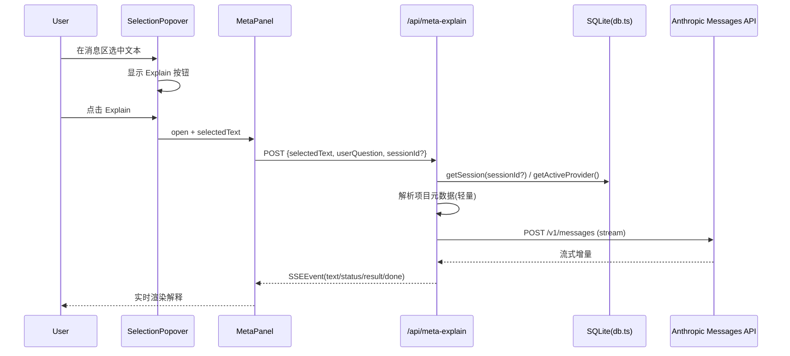

# Meta Channel（独立认知侧边栏）实现方案（V1.2）

> 版本：V1.2（修订版）  
> 日期：2026-02-16  
> 状态：Ready for Dev

## 1. 目标与非目标

### 1.1 目标

1. 在主会话之外提供“按需解释”能力，避免污染当前聊天上下文。  
2. 通过独立 UI 通道，支持“选中即问 + 连续追问”的轻量认知流程。  
3. 尽量复用现有流式渲染、Provider 配置和会话上下文能力，减少重复实现。

### 1.2 非目标（V1 不做）

1. 不接入 Claude Agent SDK，不支持工具调用（tools）。  
2. 不写入主会话 `messages` 表，不参与主会话上下文压缩。  
3. 不实现跨会话长期记忆，仅保持面板生命周期内的短会话历史。

---

## 2. V1.2 关键修订

1. **流式协议明确化**  
   后端必须输出与现有前端一致的 SSE 事件结构：`data: {"type":"...","data":"..."}`，事件类型复用 `SSEEvent`。

2. **Provider 兼容范围收敛**  
   V1 仅支持可直接映射到 Anthropic Messages API 的配置；无法映射时快速失败并返回明确错误码。

3. **前端状态拆分**  
   `metaSelection` 等高频状态不进入 `PanelContext`，避免顶层全局重渲染。

4. **上下文回退路径补齐**  
   `sessionId` 改为可选，支持 `workingDirectory` 直传和“无项目上下文”降级模式。

5. **安全与性能边界补齐**  
   增加路径校验、目录扫描限制、请求体长度限制、超时与中断策略。

---

## 3. 交互设计（UX）

### 3.1 触发入口（Selection Entry）

1. 监听范围限定在 Chat 消息渲染容器内（`ChatView` / `MessageList`），不做全局 `document` 监听。  
2. 用户选中消息文本后，显示浮动 `Explain` 按钮。  
3. 点击 `Explain`：
   - 记录 `selectedText` 与可选 `language`；
   - 打开右侧 Meta Panel；
   - 自动发起首问（默认 `Explain this`）。

### 3.2 Meta Panel 形态

1. 桌面端：右侧 Overlay Drawer，覆盖在现有右侧区域之上。  
2. 小屏（`<lg`）：全屏 Sheet（非右抽屉），避免与隐藏侧栏语义冲突。  
3. 结构：
   - Header：`Meta Explain` + 关闭按钮；  
   - Context Card：展示当前选中文本（可折叠）；  
   - Message List：独立问答流；  
   - Input：可连续追问。

### 3.3 生命周期

1. 面板关闭即中断当前流式请求（`AbortController`）。  
2. 面板重开默认清空历史（V1），后续版本再讨论持久化。

---

## 4. 技术架构

### 4.1 前端模块

1. **新增 `components/meta/SelectionPopover.tsx`**  
   - 仅在消息区域挂载；  
   - 处理选区定位与按钮显示；  
   - 触发打开 Meta Panel。

2. **新增 `components/meta/MetaPanel.tsx`**  
   - 维护独立消息列表与输入框；  
   - 发起 `/api/meta-explain` 流式请求；  
   - 复用现有 SSE 消费逻辑（`consumeSSEStream`）。

3. **新增独立状态容器（建议）**  
   - `components/meta/MetaPanelContext.tsx`（或同级 hook）；  
   - 管理 `open`、`selection`、`history`；  
   - 不扩展 `src/hooks/usePanel.ts` 的高频状态。

4. **`AppShell` 集成**  
   在 `RightPanel` 之后挂载 `<MetaPanel />`，保证层级覆盖与动画独立。

### 4.2 后端 API：`POST /api/meta-explain`

#### Request Body

```ts
{
  selectedText: string;          // 必填，最大 8k chars
  userQuestion?: string;         // 默认 "Explain this"
  sessionId?: string;            // 可选，用于反查 working_directory
  workingDirectory?: string;     // 可选，sessionId 缺失时兜底
  languageHint?: string;         // 可选，如 "typescript"
  contextLines?: string;         // 可选，前后文摘要
}
```

#### Context Resolution（优先级）

1. 有 `sessionId`：从 DB 读取 session，并取 `working_directory`。  
2. 无 `sessionId` 但有 `workingDirectory`：直接使用。  
3. 两者都无：进入“无项目上下文”模式，仅解释选中文本。

#### Project Metadata（轻量注入）

1. 尝试读取 `package.json`（存在则提取 name/dependencies 关键信息）。  
2. 读取项目第一层目录名（限制数量，忽略大目录）。  
3. 禁止全量扫描文件内容。

### 4.3 Provider 解析与兼容策略

1. 数据来源：`getActiveProvider()`。  
2. V1 支持：可直接映射为 Anthropic Messages HTTP 调用的配置。  
3. V1 不支持：无法映射到 Messages API 的 provider（返回 `422 PROVIDER_UNSUPPORTED`）。  
4. 无可用 key：返回 `400 PROVIDER_NOT_CONFIGURED`，前端提示“请先在 Settings 配置 API Provider”。

### 4.4 SSE 协议（必须与现有前端兼容）

后端输出格式固定为：

```text
data: {"type":"text","data":"..."}

data: {"type":"status","data":"Connected (claude)"}

data: {"type":"result","data":"{\"usage\":{\"input_tokens\":123,\"output_tokens\":456}}"}

data: {"type":"done","data":""}
```

#### 事件类型（Meta 最小集）

1. `status`：连接/阶段状态。  
2. `text`：文本增量。  
3. `result`：最终 token usage。  
4. `error`：错误信息。  
5. `done`：流结束。

> 说明：Meta Channel 不涉及 tool 调用，`tool_*` 事件在 V1 不输出。

### 4.5 中断与超时

1. 客户端关闭面板或切换选区时，主动 `abort()` 当前请求。  
2. 服务端监听 `request.signal`，并中止上游 LLM 请求。  
3. 设置上游请求超时（建议 60s），超时返回 `error + done`。

---

## 5. Prompt 组装规范

### 5.1 System Prompt（固定模板）

```text
You are an expert code explainer embedded in a coding tool.
Be concise and practical.
Focus on why/how, not basic syntax unless asked.
If context is insufficient, state assumptions explicitly.
```

### 5.2 Context Blocks（按可用性拼接）

1. Project path（有则注入）。  
2. Tech stack inference（来自 package.json）。  
3. Directory summary（受限条目）。  
4. User selection（原文块）。  
5. User question（默认 Explain this）。

### 5.3 输出风格

1. 默认简洁。  
2. 优先回答“这段在做什么 + 为什么这样写 + 常见坑/改法”。  
3. 不主动展开基础语法教学。

---

## 6. 数据流



---

## 7. 实施步骤（Plan）

### Phase 1：后端最小可用

1. 创建 `src/app/api/meta-explain/route.ts`。  
2. 完成 Provider 解析、请求校验、Prompt 组装。  
3. 完成 Anthropic 流式到 `SSEEvent` 的转换。

### Phase 2：前端入口与面板

1. 实现 `SelectionPopover`（仅消息区有效）。  
2. 实现 `MetaPanel` UI 与输入/历史管理。  
3. 在 `AppShell` 挂载 Overlay/Sheet。

### Phase 3：上下文增强与收尾

1. 添加 `package.json + 目录摘要` 注入。  
2. 完成错误提示、空态、Abort 流程。  
3. 补充测试与文档。

---

## 8. 验收标准（必须满足）

1. 选中文本后可稳定唤起 Explain，不影响主会话输入。  
2. Meta 问答不写入主会话 `messages`。  
3. 面板关闭后流式请求被中断，且无悬挂状态。  
4. Provider 缺失/不支持时给出明确错误提示。  
5. SSE 在弱网下不中断解析（至少保证 `text/error/done` 可恢复）。  
6. 小屏下展示为全屏 Sheet，交互可用。

---

## 9. 风险与后续

1. 直连 Messages API 与现有 SDK 通路存在重复配置逻辑，后续建议抽象共享 Provider Resolver。  
2. 若后续需要“Meta 结果引用回主会话”，需设计显式“插入主输入框”动作，避免隐式上下文污染。  
3. 若后续要做持久化，建议新增独立 `meta_sessions/meta_messages` 表，不复用主消息表。
